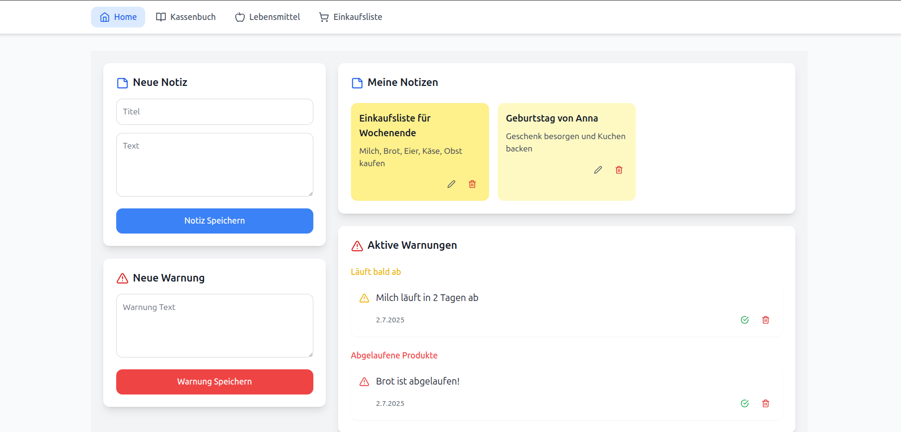
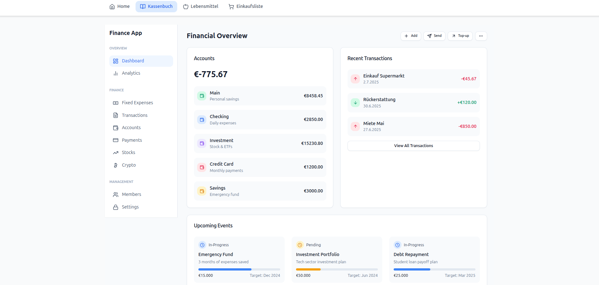
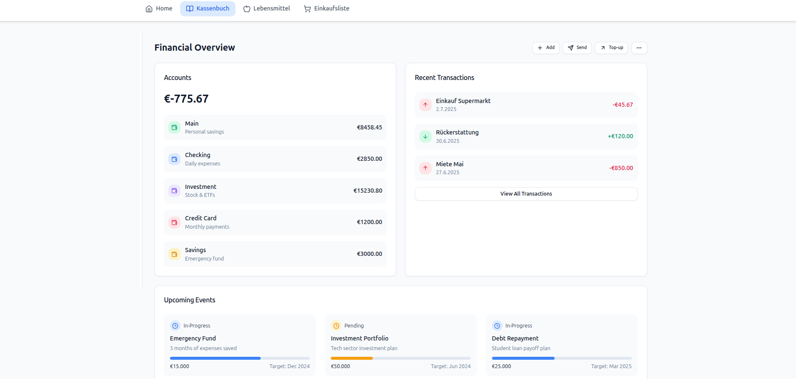
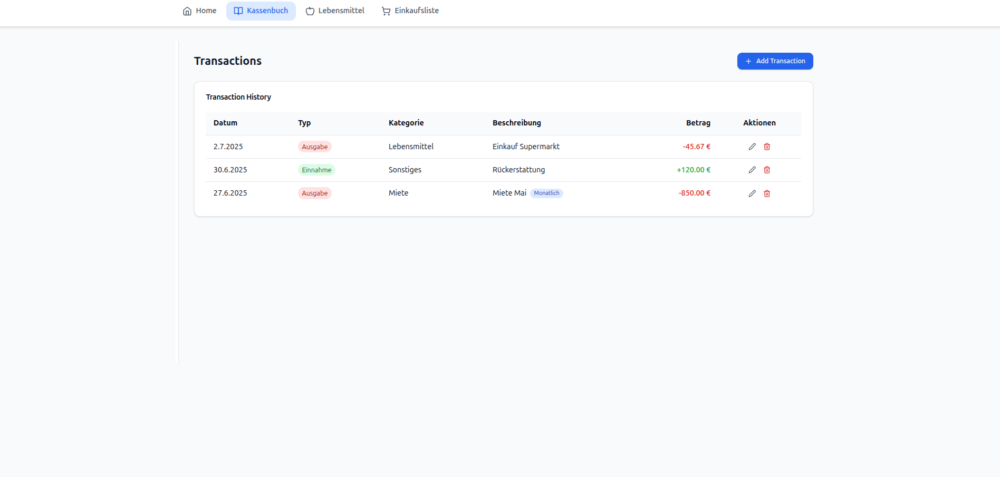
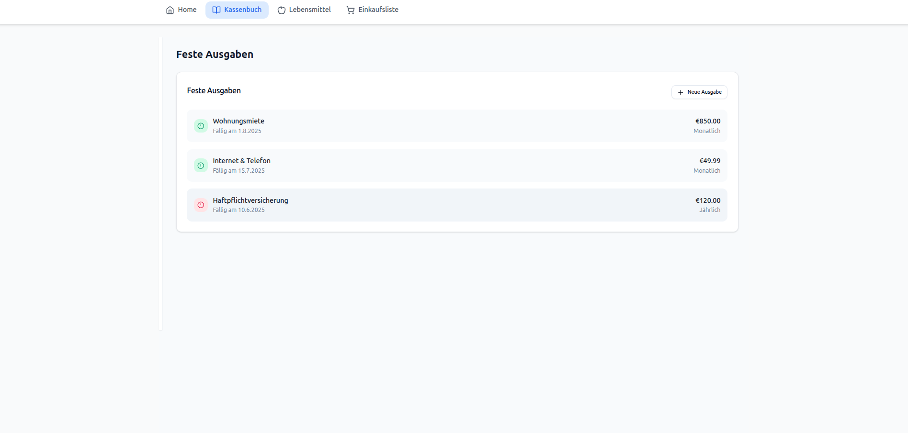
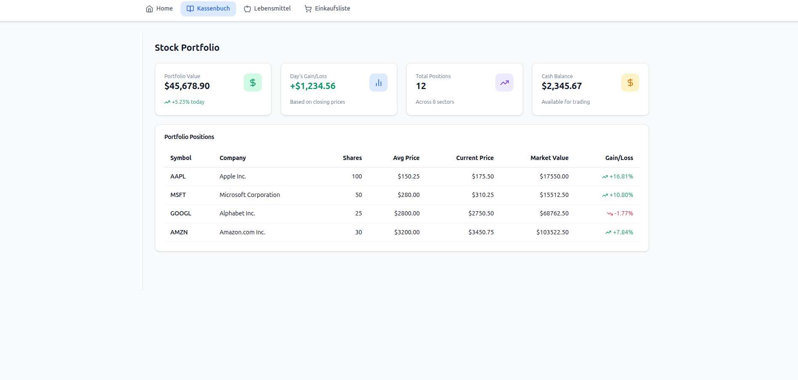
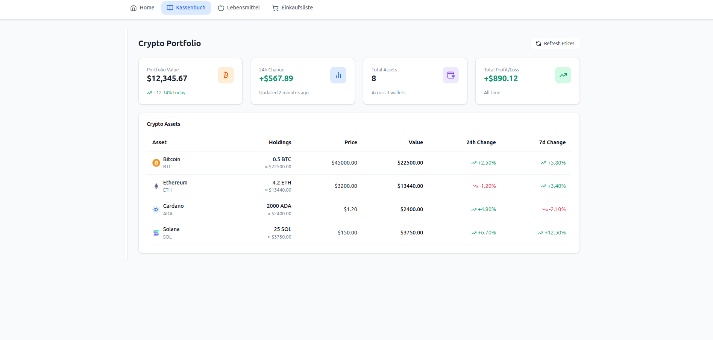
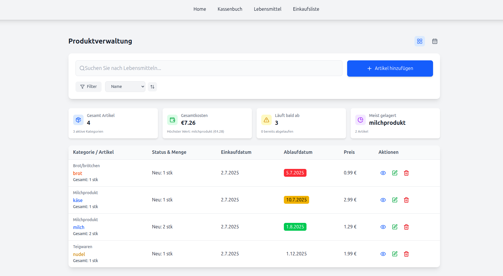

# 🏠 HaushaltsApp - Smart Household Management System

<div align="center">
  
  
  [](https://www.typescriptlang.org/)
  [](https://reactjs.org/)
  [](https://nodejs.org/)
  [](https://www.mongodb.com/)
  [](https://tailwindcss.com/)
</div>

## 📋 Inhaltsverzeichnis

- [Über das Projekt](#über-das-projekt)
- [Features](#features)
- [Technologie-Stack](#technologie-stack)
- [Installation](#installation)
- [Verwendung](#verwendung)
- [API-Dokumentation](#api-dokumentation)
- [Projektstruktur](#projektstruktur)
- [Mitwirken](#mitwirken)
- [Lizenz](#lizenz)
- [Kontakt](#kontakt)

## 🎯 Über das Projekt

**HaushaltsApp** ist eine moderne, vollständig integrierte Haushaltsmanagement-Lösung, die entwickelt wurde, um Familien und Einzelpersonen dabei zu helfen, ihre täglichen Haushaltsaufgaben effizient zu verwalten. Die Anwendung kombiniert Lebensmittelverwaltung, Finanzplanung, Einkaufslisten und intelligente Benachrichtigungen in einer benutzerfreundlichen Oberfläche.

### 🌟 Warum HaushaltsApp?

- **Zentrale Verwaltung**: Alle Haushaltsaspekte an einem Ort
- **Intelligente Automatisierung**: Automatische Warnungen und Erinnerungen
- **Familienfreundlich**: Multi-User-Unterstützung für die ganze Familie
- **Datengetrieben**: Detaillierte Analysen und Berichte
- **Modern & Responsiv**: Optimiert für alle Geräte

## ✨ Features

### 🍎 Lebensmittelverwaltung

- **Intelligente Bestandsverfolgung**: Automatische Überwachung von Ablaufdaten
- **Kategorisierung**: Organisierte Verwaltung nach Produktkategorien
- **Status-Tracking**: Unterscheidung zwischen neuen und angebrochenen Produkten
- **Kalenderansicht**: Visuelle Darstellung der Ablaufdaten
- **Preisverfolgung**: Kostenanalyse und Budgetplanung

### 💰 Kassenbuch (Finanzmanagement)

- **Transaktionsverwaltung**: Detaillierte Ein- und Ausgabenverfolgung
- **Feste Ausgaben**: Verwaltung wiederkehrender Kosten
- **Konten-Management**: Multi-Account-Unterstützung
- **Analytics Dashboard**: Umfassende Finanzanalysen
- **Zahlungsplanung**: Terminierte und wiederkehrende Zahlungen
- **Investment Tracking**: Aktien- und Krypto-Portfolio-Verwaltung

### 🛒 Einkaufslisten

- **Dynamische Listen**: Intelligente Produktvorschläge
- **Kategoriebasiert**: Organisierte Einkaufserfahrung
- **Mengenplanung**: Präzise Bedarfsermittlung
- **Familien-Sync**: Geteilte Listen für alle Familienmitglieder
- **Offline-Fähigkeit**: Funktioniert auch ohne Internetverbindung

### 🔔 Intelligente Benachrichtigungen

- **Ablaufwarnungen**: Proaktive Benachrichtigungen vor Produktablauf
- **Bestandsalarme**: Warnungen bei niedrigen Lagerbeständen
- **Zahlungserinnerungen**: Automatische Erinnerungen für fällige Rechnungen
- **Budgetwarnungen**: Benachrichtigungen bei Budgetüberschreitungen

### 📊 Dashboard & Analytics

- **Übersichtsdashboard**: Zentrale Informationsanzeige
- **Ausgabenanalyse**: Detaillierte Kostenaufschlüsselung
- **Trends & Prognosen**: Datenbasierte Vorhersagen
- **Exportfunktionen**: PDF- und Excel-Export für Berichte

## 🛠 Technologie-Stack

### Frontend

- **React 18** - Moderne UI-Bibliothek mit Hooks
- **TypeScript** - Typsichere Entwicklung
- **Vite** - Schneller Build-Tool und Dev-Server
- **Tailwind CSS** - Utility-First CSS Framework
- **React Query (TanStack Query)** - Datenmanagement und Caching
- **React Router** - Client-seitige Navigation
- **Lucide React** - Moderne Icon-Bibliothek
- **React Hook Form** - Performante Formularvalidierung
- **Date-fns** - Moderne Datums-Utilities

### Backend

- **Node.js** - JavaScript-Runtime
- **Express.js** - Web-Framework
- **TypeScript** - Typsichere Backend-Entwicklung
- **MongoDB** - NoSQL-Datenbank
- **Mongoose** - MongoDB Object Modeling
- **CORS** - Cross-Origin Resource Sharing
- **dotenv** - Umgebungsvariablen-Management

### State Management & Data Flow

- **React Query** - Server State Management
- **React Context** - Globaler Client State
- **Custom Hooks** - Wiederverwendbare Geschäftslogik

### Development Tools

- **ESLint** - Code-Qualität und Konsistenz
- **Prettier** - Code-Formatierung
- **Concurrently** - Parallele Script-Ausführung
- **ts-node-dev** - TypeScript Development Server

### UI/UX Libraries

- **Radix UI** - Headless UI-Komponenten
- **Class Variance Authority** - Conditional CSS Classes
- **Tailwind Merge** - Tailwind Class Merging
- **React Toastify** - Toast-Benachrichtigungen

## 🚀 Installation

### Voraussetzungen

- Node.js (v18 oder höher)
- npm oder yarn
- MongoDB Atlas Account oder lokale MongoDB-Installation

### 1. Repository klonen

```bash
git clone https://github.com/yourusername/haushalts-app.git
cd haushalts-app
```

### 2. Dependencies installieren

**Frontend:**

```bash
npm install
```

**Backend:**

```bash
cd server
npm install
```

### 3. Umgebungsvariablen konfigurieren

Erstellen Sie eine `.env` Datei im `server` Verzeichnis:

```env
MONGODB_URI=your_mongodb_connection_string
PORT=3000
NODE_ENV=development
```

### 4. Anwendung starten

**Development Mode (Frontend + Backend):**

```bash
npm start
```

**Oder separat:**

Frontend:

```bash
npm run dev
```

Backend:

```bash
npm run server:dev
```

### 5. Anwendung öffnen

Öffnen Sie [http://localhost:5173](http://localhost:5173) in Ihrem Browser.

## 📱 Verwendung

### Erste Schritte

1. **Dashboard**: Überblick über alle wichtigen Informationen
2. **Lebensmittel hinzufügen**: Scannen oder manuell eingeben
3. **Einkaufsliste erstellen**: Basierend auf Bestand oder manuell
4. **Finanzen verwalten**: Transaktionen und Budgets einrichten
5. **Benachrichtigungen**: Automatische Warnungen aktivieren

### Hauptfunktionen

#### Lebensmittelverwaltung

- Produkte nach Kategorien organisieren
- Ablaufdaten im Kalender verfolgen
- Bestandsmengen aktualisieren
- Preise für Kostenanalyse erfassen

#### Kassenbuch

- Einnahmen und Ausgaben kategorisieren
- Wiederkehrende Transaktionen einrichten
- Budgets definieren und überwachen
- Finanzberichte generieren

#### Einkaufslisten

- Intelligente Produktvorschläge nutzen
- Listen mit Familie teilen
- Mengen und Einheiten spezifizieren
- Erledigte Artikel abhaken

## 📚 API-Dokumentation

### Lebensmittel Endpoints

```
GET    /api/lebensmittel          - Alle Lebensmittel abrufen
POST   /api/lebensmittel          - Neues Lebensmittel erstellen
PUT    /api/lebensmittel/:id      - Lebensmittel aktualisieren
DELETE /api/lebensmittel/:id      - Lebensmittel löschen
```

### Kassenbuch Endpoints

```
GET    /api/transactions          - Alle Transaktionen abrufen
POST   /api/transactions          - Neue Transaktion erstellen
PUT    /api/transactions/:id      - Transaktion aktualisieren
DELETE /api/transactions/:id      - Transaktion löschen
GET    /api/transactions/monthly-stats - Monatsstatistiken
```

### Einkaufslisten Endpoints

```
GET    /api/einkaufsliste         - Alle Listen abrufen
POST   /api/einkaufsliste         - Neue Liste erstellen
PUT    /api/einkaufsliste/:id     - Liste aktualisieren
DELETE /api/einkaufsliste/:id     - Liste löschen
```

## 🔧 Entwicklung

### Code-Qualität

- **ESLint**: Automatische Code-Analyse
- **TypeScript**: Compile-time Typsicherheit
- **Prettier**: Konsistente Code-Formatierung

### Testing

```bash
# Unit Tests ausführen
npm test

# E2E Tests ausführen
npm run test:e2e
```

### Build für Produktion

```bash
# Frontend Build
npm run build

# Backend Build
npm run server:build
```

## 🖼️ Bildschirmfotos

<div align="center">
  <h2>📱 Uygulama Ekran Görüntüleri</h2>
  
  <!-- Resim 1 -->
  <h3>1. die Benachrichtigungsseite</h3>
  

  <!-- Resim 2 -->
  <h3>2. Finanzmanagement</h3>
  

  

  

  

  



  

  <h3>3. Lebensmittelverwaltung</h3>
  

  <h3>4. Einkauflisteverwaltung</h3>
  

  
  ...
  
  <p style="margin-top:30px;color:#666;">✨Alle Bildschirme sind der echten Benutzeroberfläche entnommen</p>
</div>
